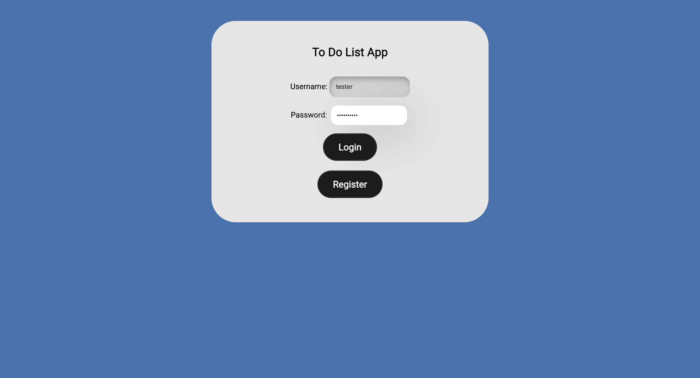
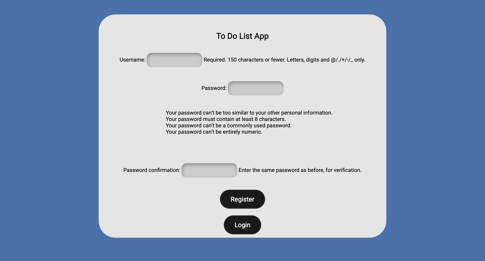
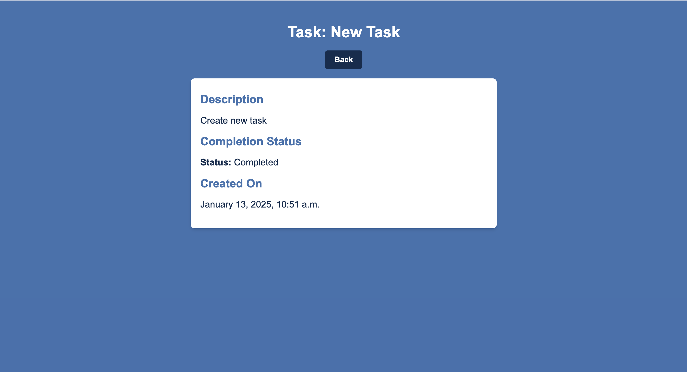
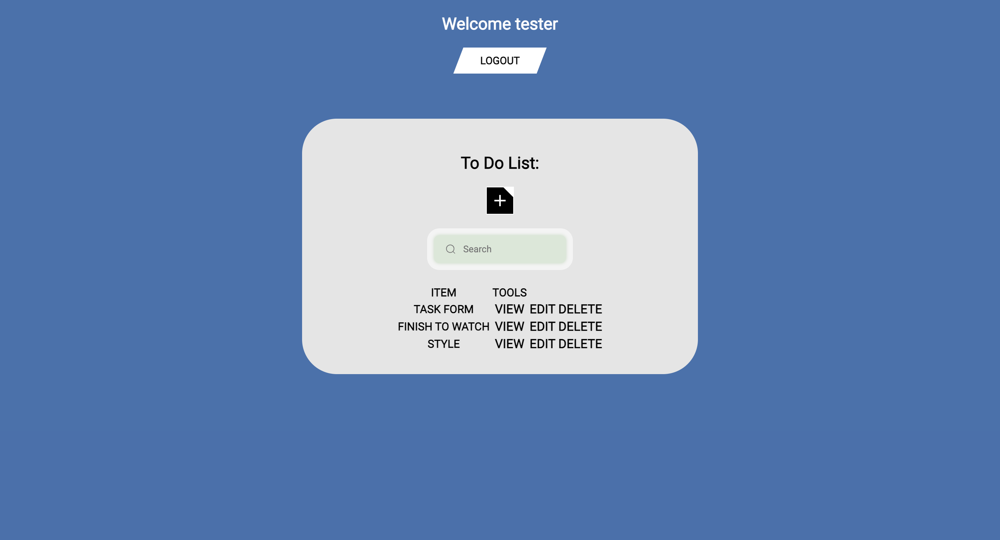
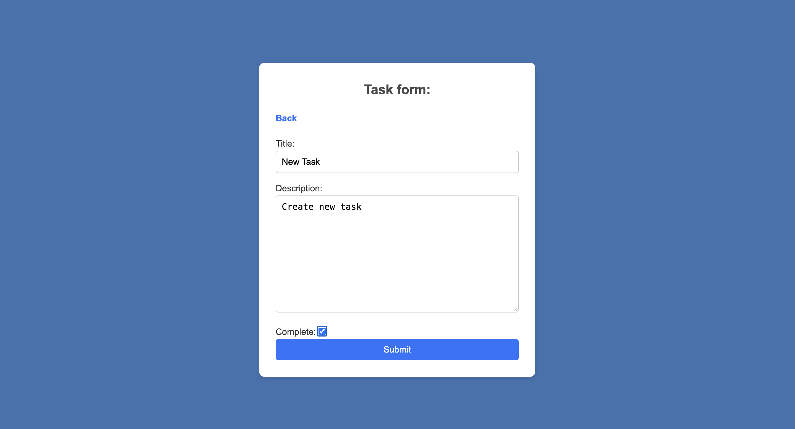
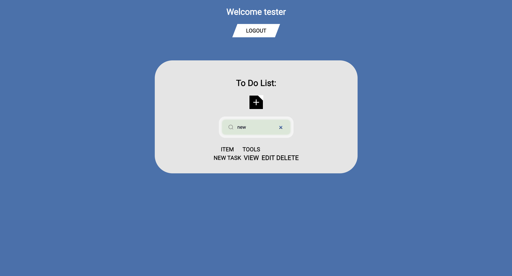
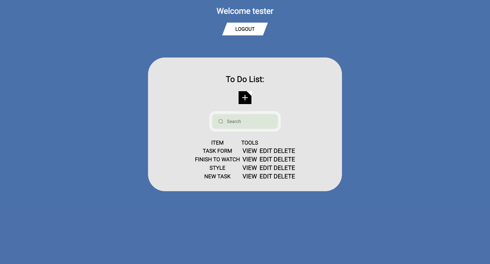
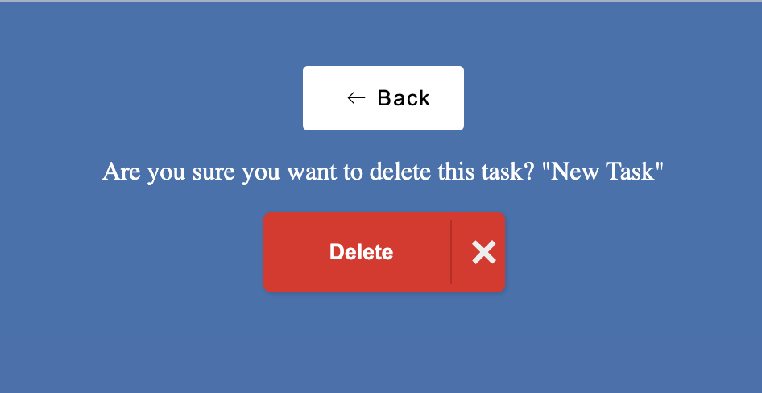

# ToDoList Project

A simple To-Do List web application built using Django. Users can manage tasks (create, view, update, and delete) while also handling authentication (register and log in). This application is a great example of a task management system with a clear and intuitive user interface.

---

## **Description**

The ToDoList project is a Django-based web application that allows users to create and manage their to-do lists. It includes basic CRUD (Create, Read, Update, Delete) operations for tasks and supports user authentication, ensuring that only logged-in users can access and modify their tasks.

### **Key Features:**
- **User Authentication**: Sign up, login, and logout functionality.
- **Task Management**: Users can create, update, view, and delete tasks.
- **Task Details**: View detailed descriptions of tasks.
- **Responsive UI**: The application is responsive and works well across various devices.

---

## **Project Requirements List**

To run this project, the following tools and technologies are required:

### **System Requirements:**
- Python 3.x
- Django 4.x (or latest stable version)
- SQLite (default database engine used by Django)

### **Software Requirements:**
- Text editor (VS Code, Sublime Text, etc.)
- Command line interface (Terminal/Command Prompt)
- Web browser for viewing the application

### **Installation Requirements:**
1. **Clone the repository**:
   ```bash
   git clone https://github.com/your-username/todolist.git
   ```

2. **Create virtual environment**:
   ```bash
   python3 -m venv env
   python -m venv env
   ```
   
3. **Install project dependencies**:
   ```bash
   cd todolist
   pip install -r requirements.txt
   ```

4. **Setup the database**:
   ```bash
   python manage.py migrate
   ```

5. **Create a superuser**:
   ```bash
   python manage.py createsuperuser
   ```

6. **Run the server**:
   ```bash
   python manage.py runserver
   ```

7. **Access the app**: 
   Visit `http://127.0.0.1:8000/` in your web browser.

---

## **Screenshots**

You can add relevant screenshots of your application here. For example:











---

## **Sample Data**

Here is a sample data for tasks that can be inserted into the application for testing:

### Sample Task:
- **Title**: Complete Django Tutorial
- **Description**: Finish the Django ToDo List project tutorial by the end of the week.
- **Completion Status**: Incomplete
- **Created At**: 2025-01-13

You can add tasks through the web interface after logging in.

---

## **UML Class Diagram**

Below is a UML class diagram representing the structure of the application:

## **Github Repository**

The project is hosted on GitHub. You can clone, fork, and contribute to it here:

[GitHub Repository: ToDoList](https://github.com/EMMMABK/ToDo-List.git)

---

## **License**

This project is licensed under the MIT License.

---

### **Contributing**

Feel free to fork the repository and submit pull requests for any improvements, bug fixes, or new features. For reporting bugs or suggesting new features, please open an issue on GitHub.
